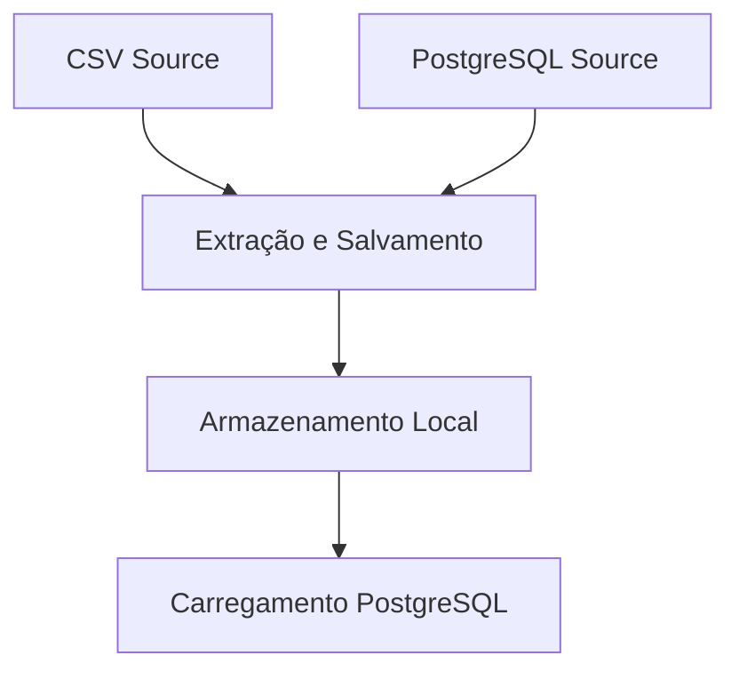

---

# **Data Pipeline para Integração de CSV e PostgreSQL**  

Este projeto implementa um pipeline de dados automatizado que combina informações de pedidos de um banco de dados PostgreSQL com detalhes armazenados em um arquivo CSV. Ele permite a consolidação de dados para facilitar consultas unificadas e gerar insights mais robustos.

---

## **Objetivo**  
Criar um pipeline que realiza as seguintes etapas:  
1. Extrair e salvar dados do PostgreSQL e de arquivos CSV localmente.  
2. Estruturar os dados com base em tabelas e datas no sistema de arquivos.  
3. Carregar os dados consolidados em um banco PostgreSQL para análises centralizadas.  
4. Garantir que cada etapa funcione de forma modular, permitindo execução e testes independentes.

---

## **Fontes de Dados e Cenário**  
- **Banco de Dados PostgreSQL**: Inclui tabelas relacionadas aos pedidos, exceto `order_details`.  
- **Arquivo CSV**: Contém os detalhes dos pedidos, complementando os dados faltantes no PostgreSQL.  
- **Desafio Principal**:  
  - Integrar fontes heterogêneas de dados.  
  - Automatizar o pipeline para rodar diariamente com logs e monitoramento.

---

## **Pipeline de Solução**  

### **Etapa 1: Extração e Salvamento Local**  
- **Objetivo**: Extrair dados do PostgreSQL e do CSV, armazenando-os com uma organização baseada em tabelas e datas no sistema local.  
- **Ferramentas**:  
  - **PostgreSQL** para origem de dados.  
  - **Sistema de Arquivos Local** como armazenamento intermediário.

### **Etapa 2: Carregamento no PostgreSQL Consolidado**  
- **Objetivo**: Carregar os dados extraídos e processados para um banco PostgreSQL final, permitindo análises integradas.  
- **Ferramentas**:  
  - **Apache Airflow** para orquestração.  
  - **Python Scripts** para execução das etapas individuais.  

---

### **Arquitetura do Pipeline**  


---

## **Configuração e Execução**  

### **1. Preparação do Ambiente**  
- **Clone o repositório**:  
  ```bash
  git clone <link do repositório>
  cd <diretório do projeto>
  ```
- **Ative o ambiente virtual (venv)**:  
  ```bash
  source venv/bin/activate  # Linux/macOS
  venv\Scripts\activate     # Windows
  ```
- **Instale as dependências**:  
  ```bash
  pip install -r requirements.txt
  ```

### **2. Configuração do Banco de Dados**  
- Crie um banco chamado `northwind`.  
- Insira as tabelas do Northwind, exceto `order_details`.  

### **3. Estrutura de Diretórios de Dados**  
Garanta que os arquivos CSV estejam na estrutura abaixo:  
```
data/csv/{data}/order_details.csv
```

---

### **4. Comandos para Iniciar os Componentes**

1. **Executando o Banco de Dados PostgreSQL com Docker**:  
   ```bash
   docker-compose up -d
   ```

2. **Testando Conexão com o Banco de Dados**:  
   ```bash
   python test_connection.py
   ```

3. **Executando o Pipeline Principal**:  
   ```bash
   python pipeline.py
   ```

### **5. Scripts do Pipeline**  

1. **`extract_csv.py`**  
   Extrai dados do arquivo CSV e os armazena localmente:  
   ```bash
   python scripts/extract_csv.py
   ```

2. **`extract_postgres.py`**  
   Conecta-se ao PostgreSQL e extrai as tabelas especificadas:  
   ```bash
   python scripts/extract_postgres.py
   ```

3. **`process_csv.py`**  
   Realiza limpeza e transformação dos dados no CSV:  
   ```bash
   python scripts/process_csv.py
   ```

4. **`load_to_postgres.py`**  
   Carrega os dados processados no banco consolidado:  
   ```bash
   python scripts/load_to_postgres.py
   ```

5. **`run_pipeline.py`**  
   Orquestra todas as etapas do pipeline:  
   ```bash
   python scripts/run_pipeline.py
   ```

---

## **Consultando os Dados Consolidado**  
Após a execução do pipeline, consulte os dados consolidados diretamente no PostgreSQL:  
```sql
SELECT *  
FROM orders o  
JOIN order_details od ON o.order_id = od.order_id;
```

---

## **Conclusão**  
Este pipeline fornece uma integração eficiente de fontes de dados distintas, transformando e consolidando informações em um ambiente único. Ele permite um fluxo contínuo e replicável para armazenamento e análises centralizadas.  

**Contribuições e sugestões são bem-vindas!**